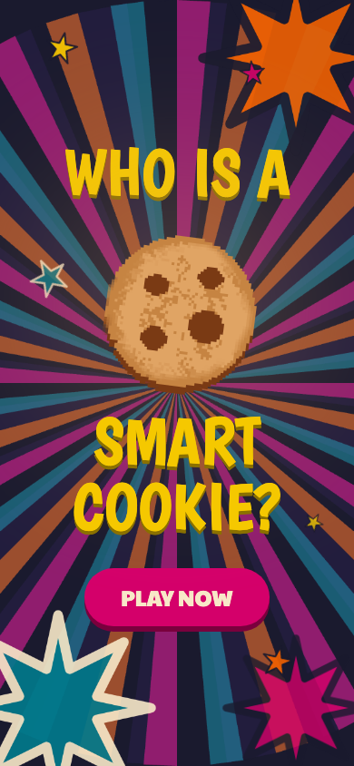
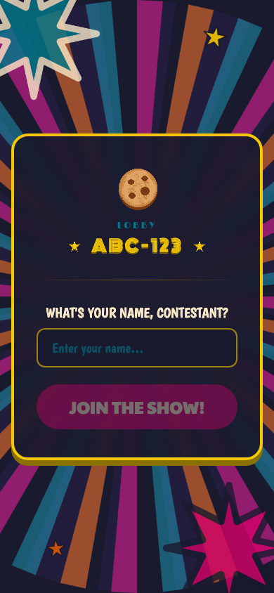
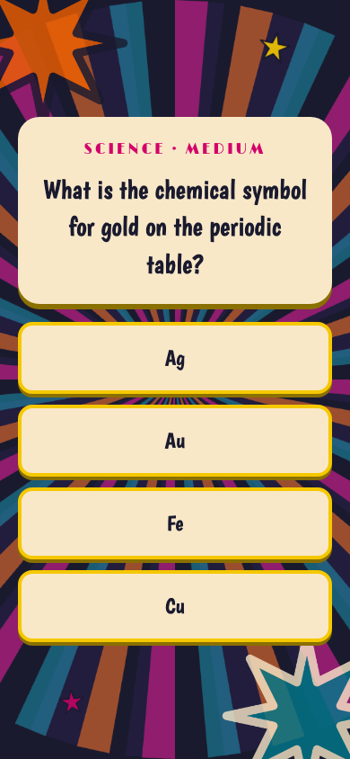
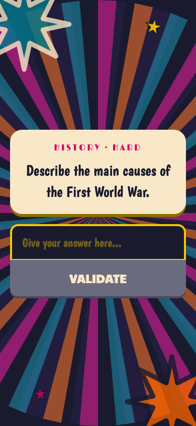

# Who is a Smart Cookie?

A mobile-first trivia game show built with SvelteKit.

## Screens

| Home | Lobby | Multiple Choice | Open Answer |
|------|-------|-----------------|-------------|
|  |  |  |  |

## Creating a project

If you're seeing this, you've probably already done this step. Congrats!

```sh
# create a new project
npx sv create my-app
```

To recreate this project with the same configuration:

```sh
# recreate this project
npx sv@0.15.3 create --template minimal --types ts --add prettier eslint vitest="usages:unit,component" playwright tailwindcss="plugins:typography,forms" mcp="ide:claude-code+setup:local" --install npm .
```

## Developing

Once you've created a project and installed dependencies with `npm install` (or `pnpm install` or `yarn`), start a development server:

```sh
npm run dev

# or start the server and open the app in a new browser tab
npm run dev -- --open
```

## Building

To create a production version of your app:

```sh
npm run build
```

You can preview the production build with `npm run preview`.

> To deploy your app, you may need to install an [adapter](https://svelte.dev/docs/kit/adapters) for your target environment.

## Color Palette

All colors are defined as Tailwind theme tokens in `src/routes/layout.css`.

| Name         | Token            | Hex       | Usage                               |
|--------------|------------------|-----------|-------------------------------------|
| Navy         | `bg-navy`        | `#1a1a2e` | Page background, dark surfaces      |
| Cream        | `bg-cream`       | `#f8e8c8` | Cards, panels, question background  |
| Game Yellow  | `bg-game-yellow` | `#f5c800` | Headings, borders, highlights       |
| Magenta      | `bg-magenta`     | `#d4006a` | CTA buttons, category labels        |
| Game Orange  | `bg-game-orange` | `#f06000` | Accents, secondary highlights       |
| Teal         | `bg-teal`        | `#007a8c` | Subtitle text, decorative accents   |
| Game Green   | `bg-game-green`  | `#2c9e58` | Validate / confirm actions          |
| Cookie       | `bg-cookie`      | `#e0a464` | Cookie glow, warm accents           |
| Gray         | `bg-gray`        | `#6b6b80` | Disabled / inactive states          |
