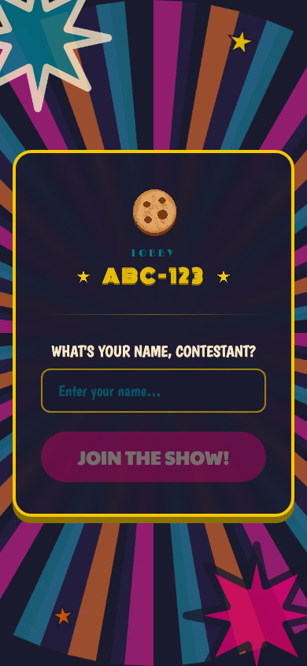
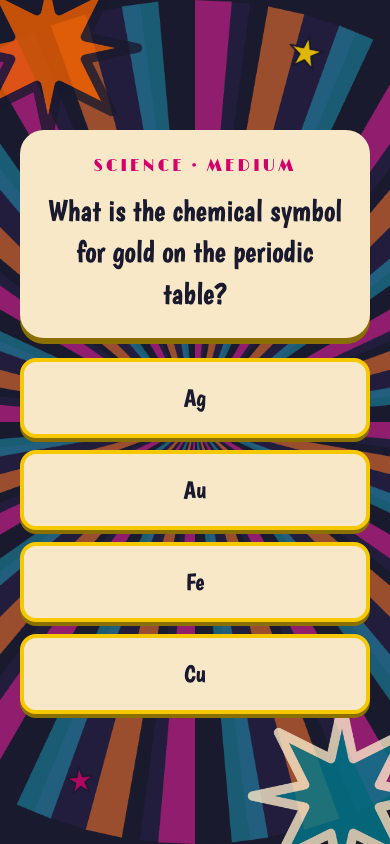
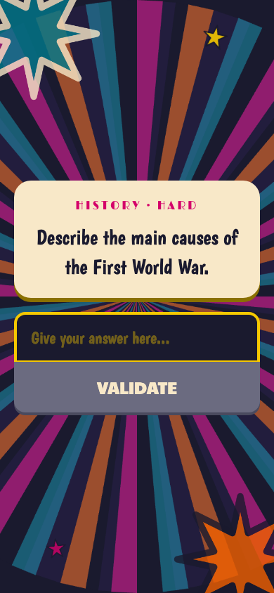
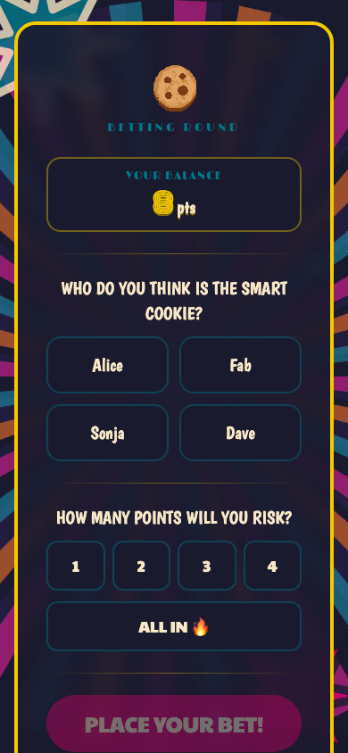

# Who is a Smart Cookie?

A mobile-first trivia game show built with SvelteKit.

## Screens

| Home | Lobby | Multiple Choice | Open Answer | Betting |
|------|-------|-----------------|-------------|---------|
|  |  |  |  |  |

## Creating a project

If you're seeing this, you've probably already done this step. Congrats!

```sh
# create a new project
npx sv create my-app
```

To recreate this project with the same configuration:

```sh
# recreate this project
npx sv@0.15.3 create --template minimal --types ts --add prettier eslint vitest="usages:unit,component" playwright tailwindcss="plugins:typography,forms" mcp="ide:claude-code+setup:local" --install npm .
```

## Developing

Once you've created a project and installed dependencies with `npm install` (or `pnpm install` or `yarn`), start a development server:

```sh
npm run dev

# or start the server and open the app in a new browser tab
npm run dev -- --open
```

## Building

To create a production version of your app:

```sh
npm run build
```

You can preview the production build with `npm run preview`.

> To deploy your app, you may need to install an [adapter](https://svelte.dev/docs/kit/adapters) for your target environment.

## Socket.IO Event Reference

The client connects to the server at `VITE_WEBSOCKET_URL` (default `http://localhost:3000`).

Most events are wrapped: `{ data: <payload>, from: <playerId>, to: null }`. The exceptions are **flat events** sent as-is (noted below).

### Client → Server

#### `join-lobby` *(flat)*
Sent when the player submits the join form.
```json
{ "lobbyId": "ABC123", "name": "Fabien" }
```

#### `player-reconnected`
Sent automatically on page reload, so the server can restore state.
```json
{ "message": "Page was refreshed" }
```

#### `submit-answer`
Sent when the player selects and confirms an answer on the multiple-choice screen.
```json
{ "answer": "Au" }
```

#### `submit-open-answer`
Sent when the player validates their text answer on the open-answer screen.
```json
{ "answer": "The assassination of Archduke Franz Ferdinand..." }
```

#### `place-bet`
Sent when the player confirms their bet on the betting screen.
```json
{ "player": "Alice", "amount": 3 }
```

---

### Server → Client

All payloads below are what the client receives after unwrapping. The server can send them either flat or wrapped in `{ data: <payload>, from, lobbyId }` — the client unwraps `data` automatically when present.

#### `connected`
Sent immediately on socket connection. Used to assign the player their socket ID.
```json
{ "from": "<socketId>" }
```

#### `player-joined-lobby`
Sent after the server accepts a `join-lobby` request. Navigates to the loading screen.
```json
{ "id": "<socketId>", "name": "Fabien" }
```

#### `change-screen`
Drives all navigation. The `screen` field determines the route. Additional fields hydrate stores before navigating.

**`loading`** — navigates to `/loading`
```json
{ "screen": "loading", "message": "The game is about to start!" }
```

**`waiting-room`** — navigates to `/loading` with a waiting message (no extra fields needed)
```json
{ "screen": "waiting-room" }
```

**`question`** — navigates to `/question`
```json
{
  "screen": "question",
  "category": "Science",
  "difficulty": "Medium",
  "text": "What is the chemical symbol for gold?",
  "answers": ["Ag", "Au", "Fe", "Cu"]
}
```

**`question-open`** — navigates to `/question-open`
```json
{
  "screen": "question-open",
  "category": "History",
  "difficulty": "Hard",
  "text": "Describe the main causes of the First World War."
}
```

**`bet`** — navigates to `/bet`, populates the player list
```json
{
  "screen": "bet",
  "players": [
    { "id": "<socketId>", "name": "Alice" },
    { "id": "<socketId>", "name": "Fabien" }
  ]
}
```

#### `update-player`
Full sync of the current player's state (e.g. on rejoin or round end).
```json
{ "id": "<socketId>", "lobbyId": "ABC123", "name": "Fabien", "balance": 12 }
```

#### `update-player-state`
Partial sync — only provided fields are merged. Used on reconnection.
```json
{ "balance": 8 }
```

#### `update-players-list`
Updates the list of players in the game (used by the bet screen).
```json
{
  "players": [
    { "id": "<socketId>", "name": "Alice" },
    { "id": "<socketId>", "name": "Fabien" }
  ]
}
```

#### `update-score`
Updates the current player's balance without a full state sync.
```json
{ "balance": 15 }
```

#### `new-message`
Pushes a notification toast that auto-dismisses after 3 seconds.
```json
{ "message": "Alice just went all in!", "author": "Host" }
```

---

## Color Palette

All colors are defined as Tailwind theme tokens in `src/routes/layout.css`.

| Name         | Token            | Hex       | Usage                               |
|--------------|------------------|-----------|-------------------------------------|
| Navy         | `bg-navy`        | `#1a1a2e` | Page background, dark surfaces      |
| Cream        | `bg-cream`       | `#f8e8c8` | Cards, panels, question background  |
| Game Yellow  | `bg-game-yellow` | `#f5c800` | Headings, borders, highlights       |
| Magenta      | `bg-magenta`     | `#d4006a` | CTA buttons, category labels        |
| Game Orange  | `bg-game-orange` | `#f06000` | Accents, secondary highlights       |
| Teal         | `bg-teal`        | `#007a8c` | Subtitle text, decorative accents   |
| Game Green   | `bg-game-green`  | `#2c9e58` | Validate / confirm actions          |
| Cookie       | `bg-cookie`      | `#e0a464` | Cookie glow, warm accents           |
| Gray         | `bg-gray`        | `#6b6b80` | Disabled / inactive states          |
